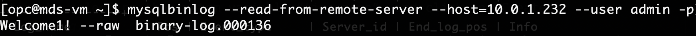

## MDS_binarylog
How to download a binary log from MDS

MDS 에서 바이너리 로그 OCI 배스천 서버에 다운로드 하는 법
(OCI 배스천 서버에서  MySQL Shell로 접속 후 해당 binary log 정보 확인)

### 1. OCI 베스천 서버에서 MySQL Shell로 접속 후 binary log 정보 확인 및 INSERT 쿼리 수행
- INSERT 쿼리 수행 

- binary log 정보 확인 : show binary logs

- 새로운 Configuration 이름을 입력 (Please give it a new name)
<!--  -->

- 아래 User variables의 variable name 필드에 timezone 선택 후 variable value에 Asia/Seoul 입력 
(Create MySQL Configuration by selecting the system variable “time_zone”  and click on “Create”)
<!--  -->
