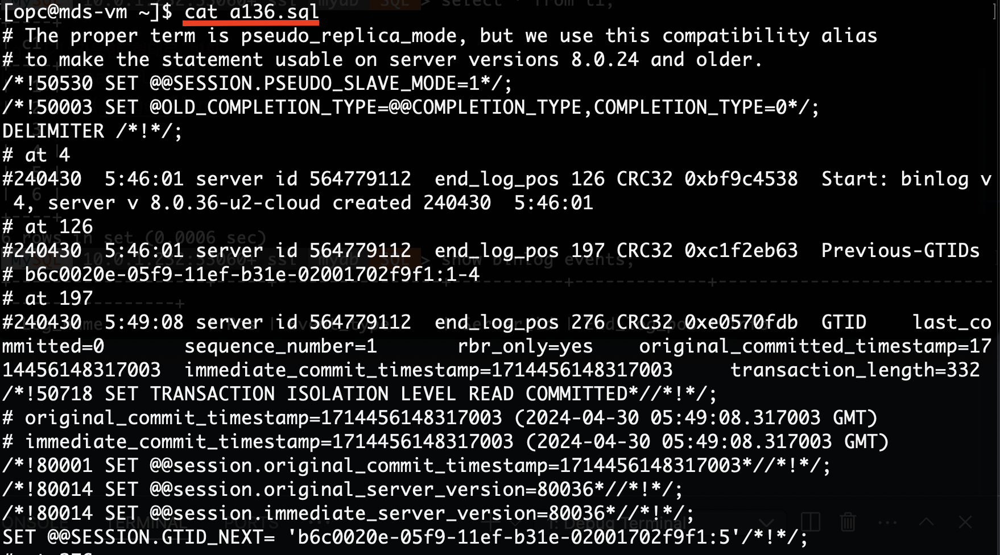

## MDS_binarylog
How to download a binary log from MDS

MDS 에서 바이너리 로그 OCI 배스천 서버에 다운로드 하는 법
(OCI 배스천 서버에서  MySQL Shell로 접속 후 해당 binary log 정보 확인)

### 1. OCI 베스천 서버에서 MySQL Shell로 접속 후 binary log 정보 확인 및 INSERT 쿼리 수행
- INSERT 쿼리 수행 

- binary log 정보 확인 : show binary logs

### 2. OCI 베스천 서버에서 mysqlbinlog 명령어를 이용해서  binary log 다운받기

### 3. 다운받은 binary log 읽기 가능한 형태로 변환
- mysqlbinlog 명령어를 이용해서 binary log 변환

- 변환된 log 확인

